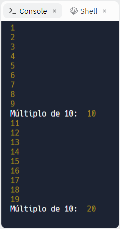

### EXERCÍCIOS (AULA 09 - COMANDOS DE REPETIÇÃO)

2.	Faça um algoritmo que conte de 1 a 100 e a cada múltiplo de 10 emita uma mensagem: “Múltiplo de 10: <número>”.

Na figura a seguir temos uma parte da exibição do resultado (neste caso, considerrando o intervalo de 1 até 20):

